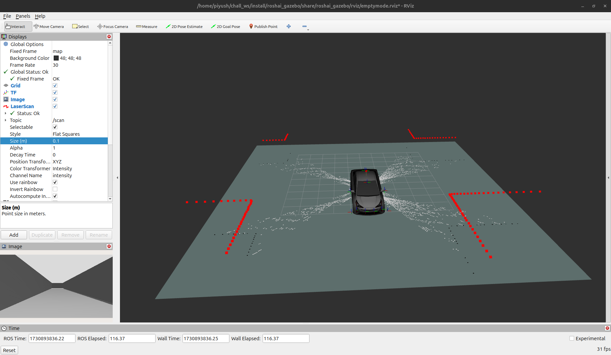

# auto_os_roshai
Make two terminal:
T1-for build and check with
```bash
  git clone https://github.com/roshai-Rosh-AI/auto_os_roshai.git src
```
```bash
 sudo apt-get install libboost-all-dev
```

For installation of gazebo simulator
```bash
sudo apt-get install gz-harmonic
```
For installation of gazebo based ros support
```bash
 sudo apt-get install ros-jazzy-ros-gz
```


T2:open dependencies folder to clone repo if required
```bash
  git clone -b ros2 https://github.com/ros/bond_core.git 
```


```bash
 git clone https://github.com/BehaviorTree/BehaviorTree.CPP.git
```


```bash
  git clone -b ros2 https://github.com/ros/diagnostics.git
```


```bash
  sudo apt-get install xtensor-dev
```


```bash
  git clone https://github.com/xtensor-stack/xsimd.git
```


```bash
  git clone -b jazzy-devel https://github.com/cra-ros-pkg/robot_localization.git
```


```bash
  git clone -b ros2 https://github.com/ros/xacro.git
```


```bash
  git clone -b jazzy https://github.com/ros-navigation/nav2_minimal_turtlebot_simulation.git
```


Check for the following commands in case you witness some other dependencies issues--
```bash
  git clone -b ros2 https://github.com/ros-geographic-info/geographic_info.git
```
    
```bash
  sudo apt install ros-jazzy-test-msgs
```
    
```bash
 sudo apt-get install graphicsmagick libgraphicsmagick++-dev
```
    
```bash
  sudo apt install libceres-dev
```
    
```bash
  git clone https://github.com/geographiclib/geographiclib.git
```
    
```bash
  sudo apt-get install libompl-dev ompl-demos
```
    
```bash
  sudo apt-get install libboost-filesystem-dev
```
    


-----
To launch the gazebo world:
change the location of the world to the desired location with the new workspace:
https://vscode.dev/github/Piyush-Rosh-AI/auto_os_roshai/blob/main/roshai_pkgs/roshai_gazebo/worlds/empty_world.world#L38

----
Also change the location of the world file and model file based upon your system configuration-piyush-roshai,chall_ws-your_ws,challenge_ws-sim_ws
Run the launch file to open for the gazebo as well as rviz world:
```bash
  ros2 launch roshai_gazebo emptyworld.launch.py
```
    
  Gazebo world

    Car Model


Run the launch file to open for the gazebo as well as rviz world:
```bash
  ros2 launch slam_toolbox online_sync_launch.py 
```
As debugger is on so we need to go is vs code and run and debug
else
remove the lines from launch file and run
    prefix=["gdbserver localhost:3000"],
    emulate_tty=True

Run the launch file to open for the gazebo as well as rviz world:
```bash
  ros2 run teleop_twist_keyboard teleop_twist_keyboard 

```
Run around the environment to create the map



  Final generated map map
